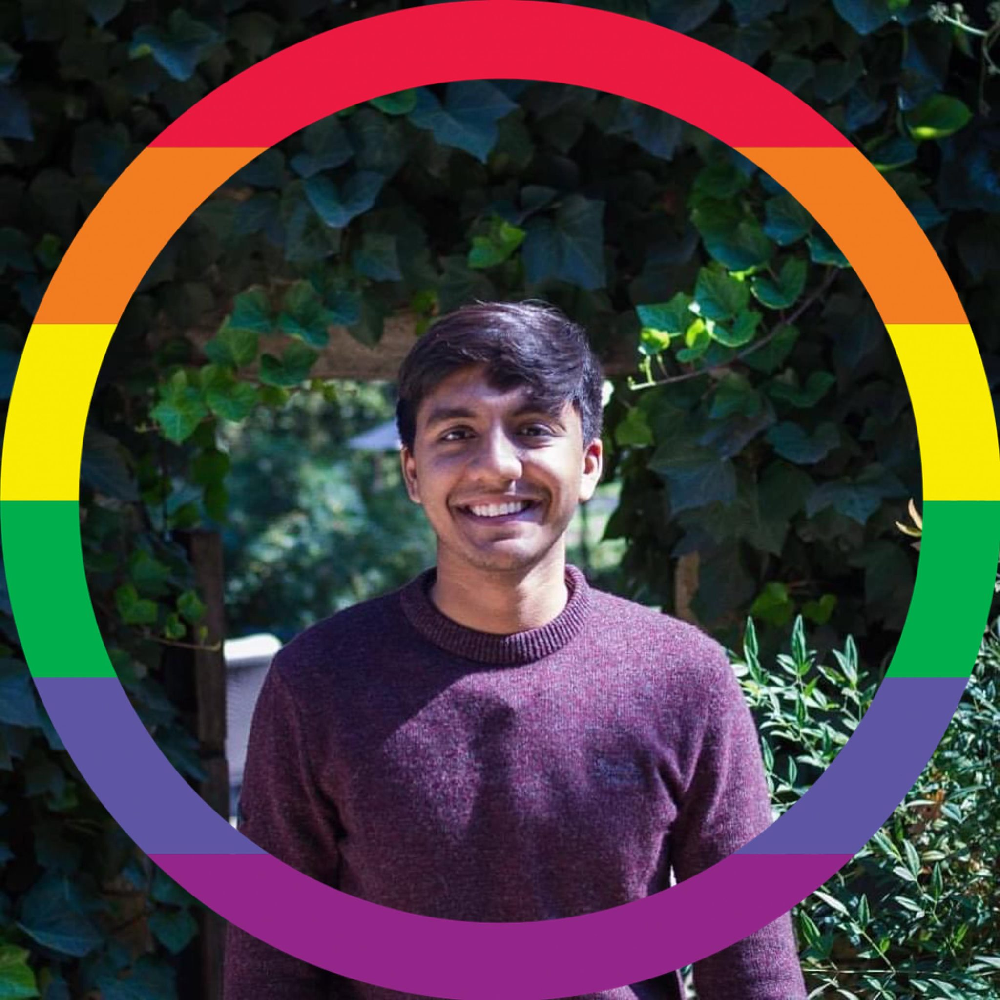

 
 

My name is Harsh (pronounced Hersh). I'm a software engineer at [Ninja Van](https://www.ninjavan.co/en-sg/about-us) and am based in Singapore.

I was born in Satna, India, but grew up in Singapore. I graduated in 2019 from the National University of Singapore. I eventually majored in Computer Engineering, but spent most of my time engaging with a liberal arts programme called the University Scholars Programme (now [NUSCollege](https://nuscollege.nus.edu.sg/)).

I spent my second year of college interning as an iOS developer at [Epic!](www.getepic.com), an educational technology start-up in the Bay Area, California.

You can view my resume [here](./resume.md).
