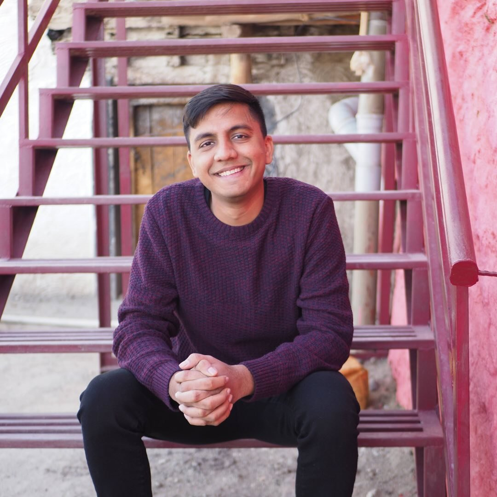

 
 

Hi, I'm Harsh. I'm currently an Engineering Manager at [Ninja Van](https://www.ninjavan.co/en-sg/about-us), a leading logistics unicorn based in Singapore, where I reside.

I graduated from the National University of Singapore in 2019 with a major in Computer Engineering. During my studies, I was deeply involved in the University Scholars Programme, now known as [NUSCollege](https://nuscollege.nus.edu.sg/), which allowed me to explore a broad range of subjects beyond engineering.

In my second year, I interned as an iOS developer at [Epic!](https://www.getepic.com), an educational technology startup in the Bay Area.

Most recently, in 2024, I completed my MBA at the [Quantic School of Business and Technology](https://quantic.edu/about/).
